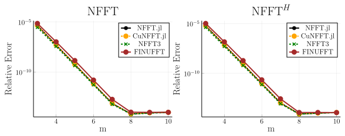
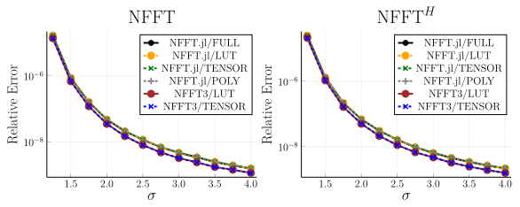
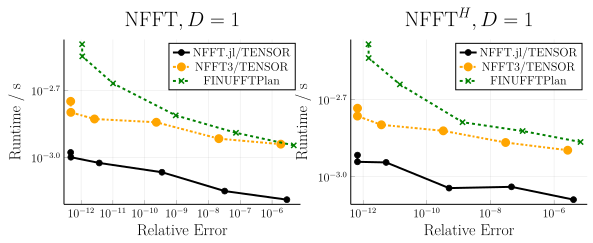
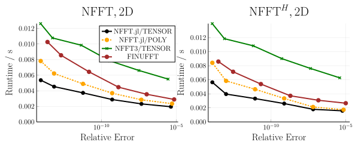
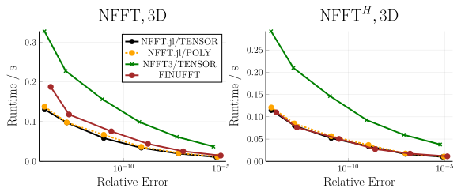
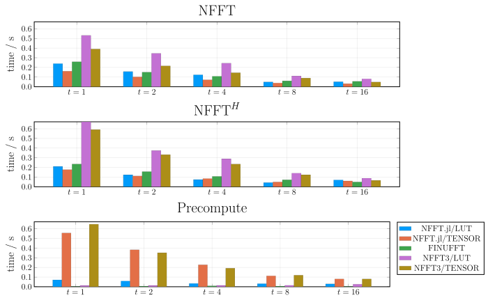

# Accuracy and Performance

On this page, the accuracy and the performance of NFFT.jl are investigated. For comparison we use
the C library NFFT3 and the C++ library FINUFFT. The shown data are useful for understanding
the performance characteristics of the NFFT and help choosing the parameters accordingly.

## Accuracy

We start with the accuracy. The following plot shows the relative error of a 2D NFFT (``N=(64,64), M=64^2``) compared to the NDFT for different choices of ``m`` and ``\sigma = 2``:

What can be seen is that the error decreases exponentially with ``m``. For about ``m=8`` the error reaches the machine precision and the NFFT then can be considered to be exact in floating point arithmetics. 

In practice, however, one often uses `Float32` instead of `Float64` in which cases ``m``  can be chosen much smaller. If the values encoded in the NFFT vectors are for instance images, a value of ``m = 3`` or ``m = 4`` is often sufficient since the human eye can only discriminate about three orders of magnitude in gray values.

Next we fix ``m`` and look at different oversampling parameters:

FINUFFT is not included in this plot since it does not allow to adjust the oversampling factor freely. One can see that the accuracy improves with increasing oversampling factor. However, one needs to keep in mind that the memory consumption of the NFFT increases with ``\sigma^D`` and in turn one usually keeps it below 2. One rule of thumb is to use ``\sigma=2`` if memory consumption is no concern and switch to ``\sigma = 1.25`` with an accordingly increased ``m`` if memory consumption is a concern (e.g. for 3D transforms).

In both figures one can see that independent implementations reach very similar accuracy. There are some smaller implementation details (different window functions, different kernel size handling) that slightly affect the accuracy. For instance NFFT3 uses a kernel size of ``(2m+2)^D`` while NFFT.jl and FINUFFT use ``(2m)^D``.

Finally, we want to look at different precomputation methods. While FULL and TENSOR are exact methods, that just cache the window function, LINEAR and POLYNOMIAL apply an approximation. However, by proper selection of the approximation parameters it is possible to keep the approximation error smaller than the error introduced by cutting of the window function. This can be verified in the following error plot.

## Performance 

Next, we investigate the performance of the NFFT and benchmark the following three operations:
* forward NFFT
* adjoint NFFT
The parameters for the benchmark are 
* ``N_\text{1D}=(8192,), N_\text{2D}=(64,64), N_\text{3D}=(32,32,32)``
* ``M=N^2``
* ``m=3, \dots, 8``
* ``\sigma = 2``
* 1 thread
* sorted random nodes
All benchmarks are performed with `@belapsed` from [BenchmarkTools.jl](https://github.com/JuliaCI/BenchmarkTools.jl) which takes the minimum of several runs (10 s upper benchmark time). The benchmark is run on a computer with 2 AMD EPYC 7702 CPUs running at 2.0 GHz (256 cores in total) and a main memory of 1024 GB. The benchmark suite is described [here](https://github.com/JuliaMath/NFFT.jl/blob/master/benchmark/Project.toml).

The results for ``D=1,\dots,3`` are shown in the following graphics. In these graphics we plot the performance versus the accuracy for various ``m``. This allows to account for the slight accuracy differences discussed earlier.

The results show that all three packages are within the same order of magnitude performance. NFFT.jl is fastest for 1D and 2D while in 3D NFFT.jl and FINUFFT are close together for the forward NFFT and FINUFFT is faster for large ``m`` and the adjoint NFFT. 

## Multi-Threading

Next, we we look at the multi-threading performance and this time keep ``m`` fixed but include different precomputation strategies and also look at the precomputation time.

The parameters for this benchmark are 
* ``N=(64,64)``
* ``M=64^2``
* ``m=4``
* ``\sigma = 2``
* 1, 2, 4, 8 threads
* precompute `NFFT.LINEAR` and `NFFT.TENSOR` for NFFT.jl and NFFT3
* sorted random nodes

The results are shown in the following graphic:

Observations:
* All packages are within a factor of about three.
* They are properly multi-threaded and scale with the number of threads.
* `NFFT.TENSOR` is faster than `NFFT.LINEAR` but has larger precomputation time.

