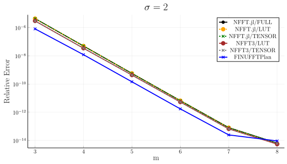

# Accuracy and Performance

On this page, the accuracy and the performance of NFFT.jl are investigated. For comparison we use
the C library NFFT3 and the C++ library FINUFFT. The shown data are useful for understanding
the performance characteristics of the NFFT and help choosing the parameters accordingly.

## Accuracy

We start with the accuracy. The following plot shows the relative error of a 2D NFFT (``N=(64,64), M=64^2``) compared to the NDFT for different choices of ``m`` and ``\sigma = 2``:

What can be seen is that the error decreases exponentially with both parameters. For about ``m=8`` and ``\sigma = 2``, the error reaches the machine precision and the NFFT then can be considered to be exact in floating point arithmetics.

In practice, however, one often uses `Float32` instead of `Float64` in which case both parameters can be chosen much smaller. Even when using ``\sigma = 1.25`` and ``m = 4`` one often has more than enough accuracy if the reconstructed image is considered to be an image with gray values, since the human eye can only discriminate about three orders of magnitude in gray values.

One can also see that independent implementations reach very similar accuracy. The accuracy for FINUFFT is a little bit higher, which might be due to the different window function being used.

## Performance

Next, we investigate the performance of the NFFT and benchmark the following three operations:
* pre-computation of the plan
* forward NFFT
* adjoint NFFT
The parameters for the benchmark are 
* ``N=(64,64)``
* ``M=64^2``
* ``m=4``
* ``\sigma = 2``
* 1, 2, 4, 8 and 16 threads
* sorted random nodes
All benchmarks are performed with `@belapsed` from [BenchmarkTools.jl](https://github.com/JuliaCI/BenchmarkTools.jl) which takes the minimum of several runs (10 s upper benchmark time). The benchmark is run on a computer with 2 AMD EPYC 7702 CPUs running at 2.0 GHz (256 cores in total) and a main memory of 1024 GB. The benchmark suite is described [here](https://github.com/JuliaMath/NFFT.jl/blob/master/benchmark/Project.toml).

The results are shown in the following graphic

Observations:
* All packages are within a factor of about three 
* They are properly multi-threaded and scale with the number of threads
* NFFT3 was benchmarked with LUT (parameter PRE\_PSI\_LUT in NFFT3) and TENSOR (NFFT3: PRE\_PSI), the later being the default option. This is because the one has much shorter precomputation time while the other is faster
* NFFT.jl and FINUFFT are very close to each other.

!!! note
    The results for FINUFFT include the precomputation time within the forward/adjoint NFFT. The reason is that it is currently not possible to create and store two independent plans with FINUFFT and in turn caching of the plan cannot be exploited in the common scenario where the forward and the adjoint NFFT are used in pairs (i.e. within iterative solvers where multiplications with ``\bm{A}^{\mathsf{H}} \bm{W} \bm{A}`` are required). 
