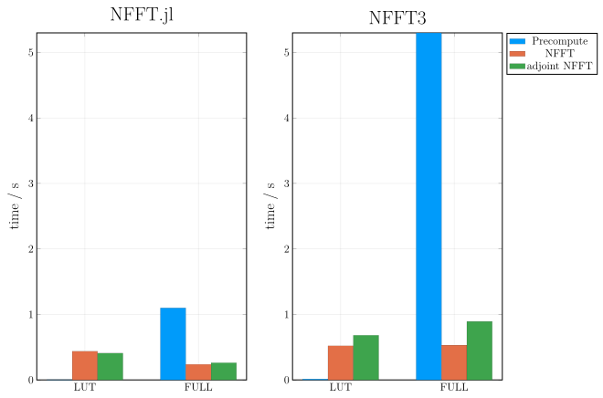

# Accuracy and Performance

!!! note
    This page is still under construction. Please do not take the accuracy and benchmarks of NFFT3 and FINUFFT seriously.

Next, the accuracy and the performance of NFFT.jl is investigated. For comparison we use
the well-tested and well-tuned C library NFFT3. The shown data are useful for understanding
the performance characteristics of the NFFT and help choosing the parameters accordingly.

## Accuracy

We start with the accuracy. The following plot shows the relative error of a 2D NFFT (``N=(64,64), M=64^2``) compared to the NDFT for different choices of ``m`` and ``\sigma``:

What can be seen is that the error decreases exponentially with both parameters. For about ``m=8`` and ``\sigma = 2``, the error reaches the machine precision and the NFFT then can be considered to be exact in floating point arithmetics.

In practice, however, one often uses `Float32` instead of `Float64` in which case both parameters can be chosen much smaller. Even when using ``\sigma = 1.25`` and ``m = 4`` one often has more than enough accuracy if the reconstructed image is considered to be an image with gray values, since the human eye can only discriminate about three orders in magnitude in gray values.

One can also see that the two independent implementations NFFT.jl and NFFT3 both reach very similar accuracy. For small ``m`` the accuracy seems to be slightly better for the NFFT3 but we have not tracked down the reason for this.

## Performance

Next, we look at the performance of the NFFT. The next graphic shows the performance for
* precomputation of the plan
* forward NFFT
* adjoint NFFT
All three are benchmarked for the NFFT.jl and the NFFT3 as well as for two precomputation strategies. The parameters for the benchmark are 
* ``N=(64,64)``
* ``M=64^2``
* ``m=4``
* ``\sigma = 2``
* sorted random nodes
All benchmarks are performed with `@belapsed` from [BenchmarkTools.jl](https://github.com/JuliaCI/BenchmarkTools.jl) which takes the minimum of several runs (10 s upper benchmark time).

### Single-Threaded Performance

We start with single-threaded performance:

Some observations:
* Full precomputation can take a huge amount of time. This usually only pays off when doing several runs. LUT precomputation is negligible.
* Full precomputation is not always faster
* Both libraries have similar performance.

### Multi-Threaded Performance

We next look at the multi-threading performance for 1,2,4, and 8 threads. 

